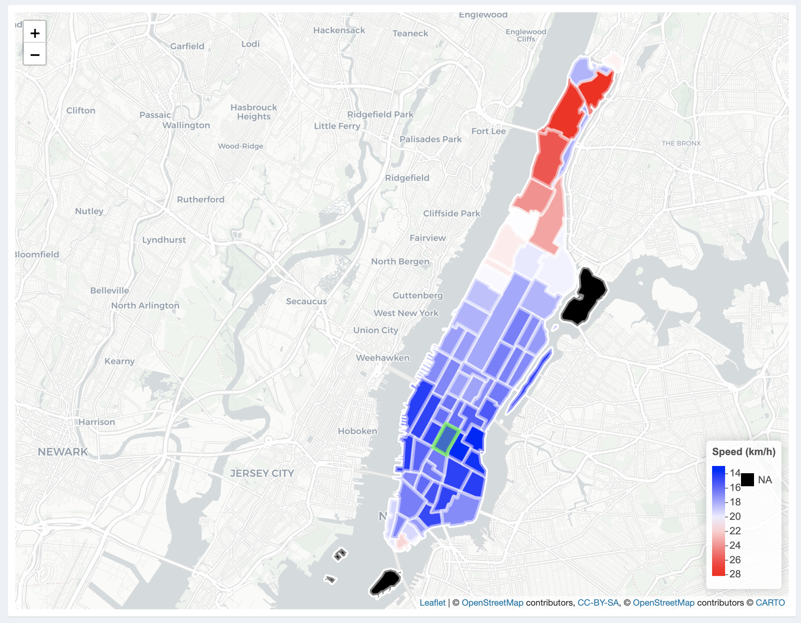

Because of the big number of taxi zones, we build two interactive maps, equal to doing analysis plotting on every taxi zones. Here are our findings.

## Velocity comparsion among different taxi zones with depature fixed

We use Velocity Heatmap to analyze the velocity difference among different taxi zones with fixed. Here we select _Washington Heights South_ taxi zone where CUMC located as the example.

### Bike

#### Distance

The velocity of bike among different taxi zones is various according to the distance of every taxi zones to _Washington Heights South_. However, possibly contrary to the usual hypothesis, _the average velocity of bike increases with distance increasing_! We think there are two possible reasons lead to this phenomenon. One explanation is that those who have to ride for long distance borrow electric bikes at the beginning, which are apparently faster than the usual bikes. Another explanation is that those who choose to ride to far places have better physical strength. Therefore, they can ride faster than usual riders.

### Taxi

#### Distance

Like bike, the average velocity of taxi also increases with distance increasing. Considering to the road traffic situations in Manhattan, we think this is reasonable. Drivers who go to far places may not choose ordinary roads which are full of traffic lights, and they may choose highway instead. For example, if one wants to go to Lower Manhattan by car from CUMC, they may take Henry Hudson Parkway, the highway along Hudson River.

#### Time

From the overall analysis, we know that the velocity of taxi is most influenced by time. Here we choose **`Union Square** taxi zone, one of the most popular places in Lower Manhattan to further analyze this phenomenon.

The left picture is during day on weekday and the right picture is during evening on weekend. Please note the **scale of the velocity** in the legend  besides the colors. It is apparently that the velocity during day on weekday slower than the velocity during evening on weekend, which is constant to our overall analysis and is fitted to the general understanding that traffic conditions is worse during commuting time period than in not working time.

### Subway

The average velocity of subway is quit stable among different taxi zones on the subway line. Possibly more influenced by the waiting time on the station platform, subways are not influenced by the traffic jam.

