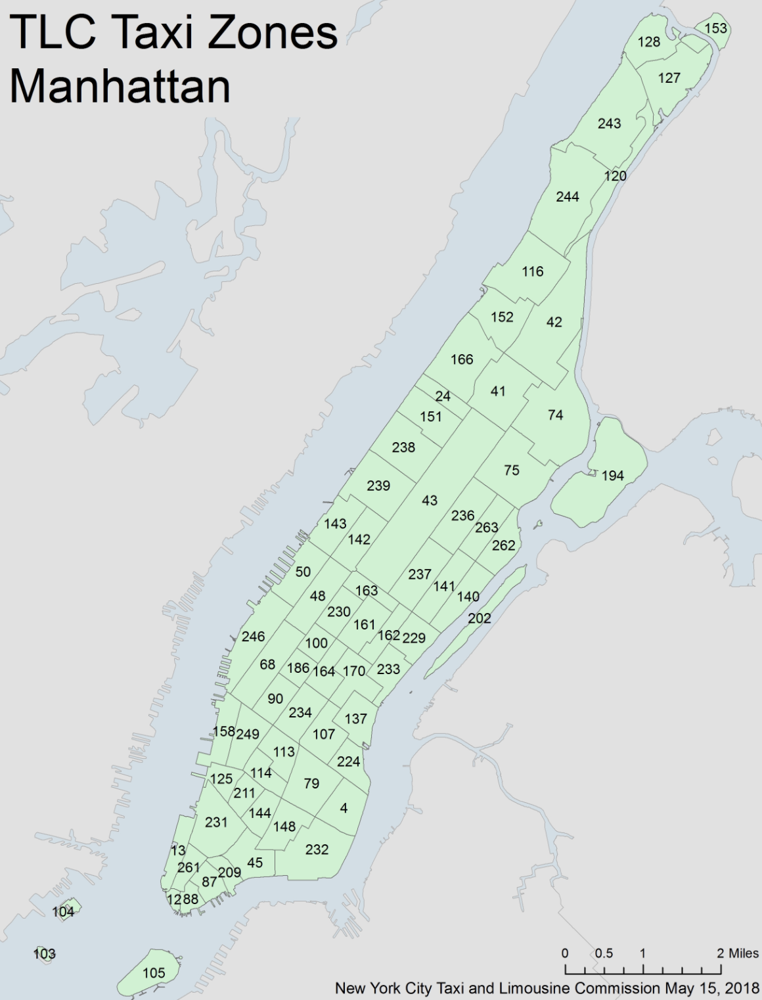

## Data Sources  

* [NYC Taxi Trip Record Data](https://www1.nyc.gov/site/tlc/about/tlc-trip-record-data.page) : We obtained the yellow taxi, green taxi and taxi zone lookup table from this website. The original yellow and green taxi datasets contain files from Jan. 2020 to Jul. 2021 with 33,671,276 and 749,439 observations, respectively. The taxi zone lookup table is shown below. 

<center>

{width=300px}

</center>


* [Dataset on Citi Bike Trip Histories](https://ride.citibikenyc.com/system-data) : Citibike dataset was obtained from the citibike website, with files from Jan. 2020 to Oct. 2021 including information on pick up locations and times, drop off locations and time, etc in Manhattan, Brooklyn, Queens and Bronx specificaly. 

* [New York City MTA](https://transitfeeds.com/p/mta) : The NYC subway schedule was obtained from the NYC MTA website, which includes 1000 trains' information on stops, arrival and departure time etc. 

## Data Cleaning

### General Techniques
The original dataset of taxi and bike is huge, contains ~30,000,000 each. So `dplyr` package is not suitable for that large amont of data which may be intensive for memeory and compuation. 
To handle tabular data, `data.table` is an alternative to R's default `data.frame` or `tibble`. Its popularity stems from the speed with which it can process enormous amounts of data and the brevity of its syntax. As a result, you enter less code and move at a far faster pace.

A key idea for our data cleaning is creating what we call `pickup - dropoff pairs`as a standard basic data entry. It consists of a pickup location, a drop off location, pick up time, drop off time and it's distance. The bike data can be easily transformed into pickup - dropoff pairs. The detail of transformation of MTA data will be described in the corresponding cleaning section.

### Bike Data 
Read in the bike data after sample
```{r eval=FALSE, echo = TRUE}
bike_dt = fread("citibike_manhattan_sample.csv")
bike_dt = bike_dt %>% janitor::clean_names() %>% as.data.table()
head(bike_dt)
bike_dt = bike_dt[, distance_hav := distHaversine(matrix(c(start_station_longitude, start_station_latitude), ncol = 2),
                                   matrix(c(end_station_longitude, end_station_latitude), ncol = 2))]
bike_dt = bike_dt[, distance_ew := distHaversine(matrix(c(start_station_longitude, start_station_latitude), ncol = 2),
                                                  matrix(c(end_station_longitude, start_station_latitude), ncol = 2))]
bike_dt = bike_dt[, distance_ns := distHaversine(matrix(c(end_station_longitude, start_station_latitude), ncol = 2),
                                                  matrix(c(end_station_longitude, end_station_latitude), ncol = 2))]
bike_dt = bike_dt[,angle_ns := atan(distance_ew/distance_ns)*2*(as.numeric(I(start_station_longitude < end_station_longitude))-0.5)*2*(as.numeric(I(start_station_latitude > end_station_latitude))-0.5) - manhattan_angle]
bike_dt = bike_dt[,distance := distance_hav*(abs(cos(angle_ns))+abs(sin(angle_ns)))]
colnames(bike_dt)
```
Some key variables discription:  

* `start_time`: bike start time, a POSIXct item,`end_time` similar  
* `start/end_station_lattitude/longitude`: lattitude/longitude of start/end station  
* `start/end_neighborhood`: the neighborhood, same to the taxi zone  
* `start/end_neighborhood_id`:the neighborhood id, same to the taxi zone id  

Next we need to estimate the distance.In the citibike dataset, trip distance was not provided, The main idea here is treat manhattan blocks as square in 28.9 degree north east, and caculate the angel $\theta$ between the start point-end point line and the block direction of manhattan(28.9 degree). Then the real distance$L_t$ can be estimated from the Haversine distance calculated from lattitude/longitude pairs $L_0$ by $L_t =L_0(\sin(\theta)+\cos(\theta))$.  

`distance_hav` is caculated by`distHaversine()`which is a provided function to calculate the distance from lattitude/longitude pairs from `geosphere`package. then we calculate the `distance_ew` and `distance_ns` to obtain a direction of start point-end point line. `angle_ns` is the $\theta$ between the start point-end point line and the block direction of manhattan(28.9 degree). And we finally obtain the `distance` object. 

Then we do some further data cleaning to format the bike data into our standard data format.
```{r eval=FALSE, echo = TRUE}
bike_dt_select = data.table(DOLocationID = bike_dt$start_neighborhood_id,
                            PULocationID = bike_dt$end_neighborhood_id,
                            tpep_pickup_datetime = bike_dt$start_time,
                            tpep_dropoff_datetime = bike_dt$end_time,
                            trip_distance = bike_dt$distance,
                            PUZone = bike_dt$start_neighborhood,
                            DOZone = bike_dt$end_neighborhood)
bike_dt_select$type = "bike"
```

### Taxi data

```{r eval=FALSE, echo = TRUE}
# read, clean, and sample -----------
res_dt_y = data.table(matrix( ncol = 0, nrow = 0))
#colnames(res_dt_y) = colnames(test_dt_zone)
for (x in list.files("raw_data/data/yellow_taxi")){
  temp_dt = fread(paste("raw_data/data/yellow_taxi/",x,sep =""))
  temp_dt = merge.data.table(temp_dt, PUloation_list, by.y = "LocationID", by.x = "PULocationID")
  temp_dt = merge.data.table(temp_dt, DOloation_list, by.y = "LocationID", by.x = "DOLocationID")
  temp_dt = as.data.table(sample_n(as_tibble(temp_dt),round(nrow(temp_dt)/10)))# random sample 10%
  cat(colnames(temp_dt))
  res_dt_y = rbind(res_dt_y,temp_dt, fill = T)
  print(x)
  print(nrow(temp_dt))
  print(nrow(res_dt_y))
}
# read, clean, and sample
res_dt_g = data.table(matrix(ncol = 0, nrow = 0))
#colnames(res_dt) = colnames(test_dt_zone)
for (x in list.files("raw_data/data/green_taxi")){
  temp_dt = fread(paste("raw_data/data/green_taxi/",x,sep =""))
  temp_dt = merge.data.table(temp_dt, PUloation_list, by.y = "LocationID", by.x = "PULocationID")
  temp_dt = merge.data.table(temp_dt, DOloation_list, by.y = "LocationID", by.x = "DOLocationID")
  temp_dt = as.data.table(sample_n(as_tibble(temp_dt),round(nrow(temp_dt)/10)))# random sample 10%
  #cat(colnames(temp_dt))
  res_dt_g = rbind(res_dt_g,temp_dt, fill = T)
  print(x)
  print(nrow(temp_dt))
  print(nrow(res_dt_g))
}
```
we iteratively read in all target data. Merge the taxi data with the taxi zone data list. and randomly select 10% of samples
Some key variables discription:  

* `PU/DOLocationID`: ID of pickup/drop off location  
* `tpep_pickup/dropoff_datetime`: date and time of pickup/drop off,a POSIXct item  
* `trip_distance` : travel distance in mile  

We can see we have create the basic `pickup - dropoff pairs`

### MTA 

basic analysis tools:
For the subway datasets, we were unable to obtain the real time MTA subway schedule, so the dataset was found on the New York City MTA with no data description. Besides, the subway dataset only categorizes the data to weekday, saturday and sunday, making it inconsistent with other datasets and difficult in making plots for comparison with other transportations. To solve this issue, 
we apply a random simulation with replacement to create the pickup-dropoff pair.

```{r eval=FALSE, echo = TRUE}
mta_dt  = fread('subway_schedule_clean.csv')
test_mta_dt = mta_dt[,.SD[sample(.N,5*.N, replace = T)],by = c("train_id","day","line")]
test_mta_dt = test_mta_dt[, tpep_pickup_datetime := as.POSIXct(departure_time,
                                                               format = "%H:%M:%S",
                                                               tz = "America/New_York")]
test_mta_dt_do = mta_dt[,.SD[sample(.N,5*.N, replace = T)],by = c("train_id","day","line")][, tpep_dropoff_datetime := as.POSIXct(arrival_time,format = "%H:%M:%S",tz = "America/New_York")]             
test_mta_dt= bind_cols(test_mta_dt,test_mta_dt_do) %>% tibble::repair_names()
test_mta_dt = test_mta_dt[, trip_distance := distHaversine(matrix(c(stop_lon...9, stop_lat...8), ncol = 2),
                                                  matrix(c(stop_lon...21, stop_lat...20), ncol = 2))]
test_mta_dt = test_mta_dt[,time:= abs(as.numeric(tpep_dropoff_datetime - tpep_pickup_datetime))]
test_mta_dt = test_mta_dt[,velocity := trip_distance/time]
test_mta_dt = test_mta_dt[time > 60]
test_mta_dt = test_mta_dt[velocity > 0] [velocity < 40]
setnames(test_mta_dt, "neighborhood_id...11", "PULocationID")
setnames(test_mta_dt, "neighborhood_id...23", "DOLocationID")
setnames(test_mta_dt,  "neighborhood...10" , "PUZone")
setnames(test_mta_dt,  "neighborhood...22" , "DOZone")
test_mta_dt = test_mta_dt[day...2 == "Sunday", week:=0]
test_mta_dt = test_mta_dt[day...2 == "Saturday", week:=6]
test_mta_dt[day...2 == "Weekday",]$week = sample(1:5,nrow(test_mta_dt[day...2 == "Weekday",]),replace = T)
test_mta_dt$month = sample(1:12,nrow(test_mta_dt),replace = T)
test_mta_dt = test_mta_dt[,type := "MTA"]
test_mta_final = test_mta_dt[,colnames(test_dt), with = F]
```

The key idea here is we consider all the transit without transfers between lines which the schedule can not simulate. We create 5 times random pairs grouped by `train_id`,`day`,`line` to make sure they are exactly the same train, same line, and same day. 5 fold is enough here because the variance of velocity for the same route is actually small compared to bike and taxi from our prior knowledge. 

### Intergration
New variables were added for visualization purposes in the `taxi_sample.csv`, `bike_sample.csv` and `subway_sample.csv` files. Below are the variables added:

- `Season`: winter(Dec-Feb), spring(Mar-May), summer(Jun-Aug), fall(Sep-Nov)
- `Duration`: the difference between pick up time and drop off time for citibike and subway: the time difference of a trip between a location pair for subway
- `Time of day`: rush_hour_am(7am - 10am), midday(10am - 4pm), rush_hour_pm(4pm - 7pm), evening(7pm - 12am), early_morning(12am - 7am)
- `Velocity`: trip distance divided by duration
- `Day Type`: weekday, weekend 

