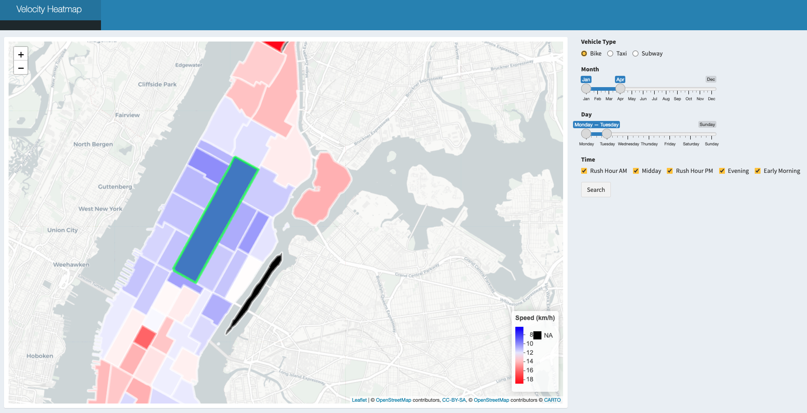
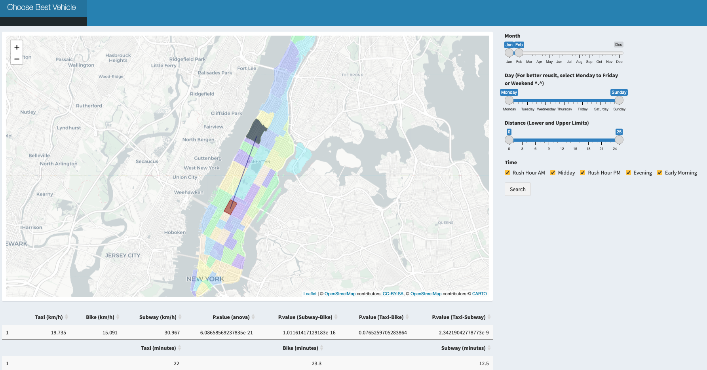

## __Interactive Maps__
The data visualization above is an overall analysis, in order to analyze the velocity between from one taxi zone to the others through different vehicles and show their geographical locations clearly, we created ___two interactive map applications___ using `R Shiny`.   

#### [**Velocity Heatmap, click it!**](http://34.138.2.255:3838/heatmap/)    
Velocity heatmap is aimed to provide a tool to better analyze the velocity differences among different taxi zones during different times of the day in different months. To create this velocity heatmap, we first integrated the leaflet package to incorporate a worldwide map, drew polygons on Manhattan and divided the areas based on the taxi zone map. Adding click actions on the map is also necessary for there are 69 taxi zones, making it hard to select taxi zones through traditional methods, like select boxes.  
  
Users are able to navigate through this velocity heatmap by selecting desired zone, vehicle type, month, day and time to compare the speed. By clicking the relative taxi zone as our departure, it helps to explore and calculate the mean speed rate to different taxi zones, and create interactive plots that respond to each mouse event, combined with R’s graphics functions.  
  

{width=700px}

  
#### [**Choose Best Vehicle, click it!**](http://34.138.2.255:3838/bestvehicle/)  
Besides comparing the speed from a fixed taxi zone to others, we also create an interactive map application to compare the speed from one taxi zone to another through taxi, bike and subway to see which one is the best during different times of the day in different months.  
  
While using this app, the users would be able to choose whatever the departure taxi zone and destination taxi zone are within Manhattan using graphic straightforward clicking. With the synchronous web search for either pick up or drop off location.

{width=700px}

## __Problems We Met__

Some challenges arose during development using `R Shiny` and the `leaflet` package. We needed to divide the Manhattan region to different taxi zones on the map and identified each click response with the corresponding area range. During which we came up and identified several problems and solved those difficulties as described below:

- ___Reducing dataset and identifying the information of taxi zones specifically within Manhattan.___   
There was a large dataset we downloaded from the website which included all data within the NYC location. We targeted to reduce the size of the data and concentrated only on the Manhattan area. Among all the information, we first identified all taxi zone names in NYC and filtered them only within Manhattan that we focused on and recorded them with the new numbers from 1 to 69.   

- ___Draw map and draw zone polygons according to taxi zone division.___     
Unlike worldwide maps that could be directly imported using `leaflet()`, the taxi zone division on Manhattan should be further processed. We downloaded a [Manhattan data](https://www1.nyc.gov/site/tlc/about/tlc-trip-record-data.page) from the web and got their location data after data cleaning. `addPolygons()` function required us to define the columns of latitude and longitude, which could be derived from our data, linking adjacent points using lines and creating shapes of interest.  

- ___What if the pick up location and drop off location are in the same taxi zone?___    
Regarding our original code, the same location could not be clicked twice which means if we double click the same taxi zone and set it as both our origin and destination, the function would return `point_bool` parameter from `TRUE` to `FALSE` and led to visualization error. To solve this problem, we used the `if` function to specify this special situation.  

- ___Merging problems while cooperating with branches.___  
We had several branches while we were dealing with our codes, and all codes would be pushed to our personal branch first before finally merging into the main branch. As we had two people mainly dealing with the `Shiny` application that needed cooperation work, it required a lot of merging process and there were several times when code overlapped or merging problems on local paths arose. Solving this problem required constant updates between members.
<!-- - Click function?(km)   -->
<!-- - Host interactive R shiny application on Github over the web. (km)   -->
