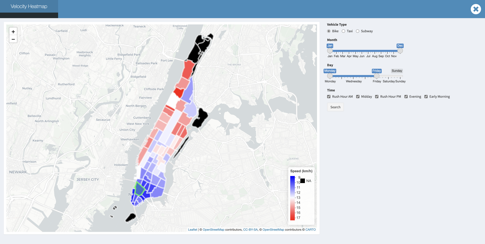
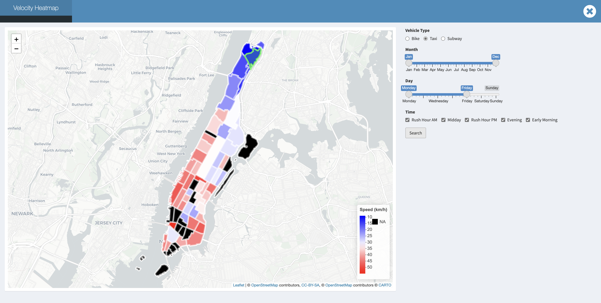
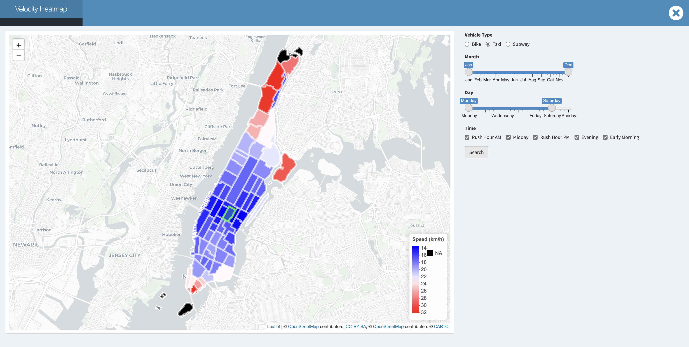
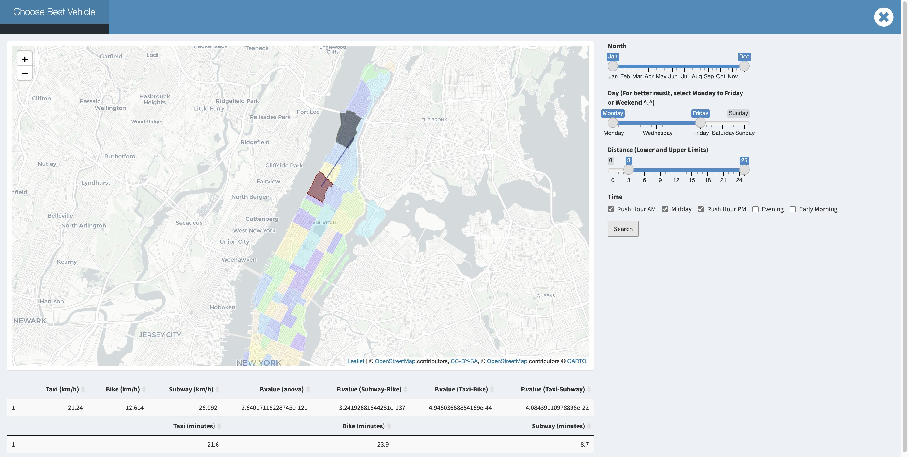
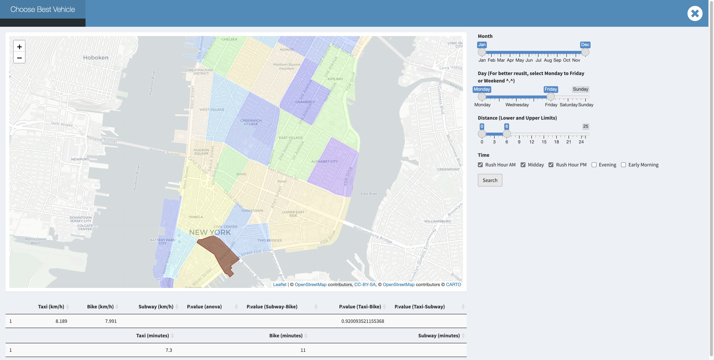
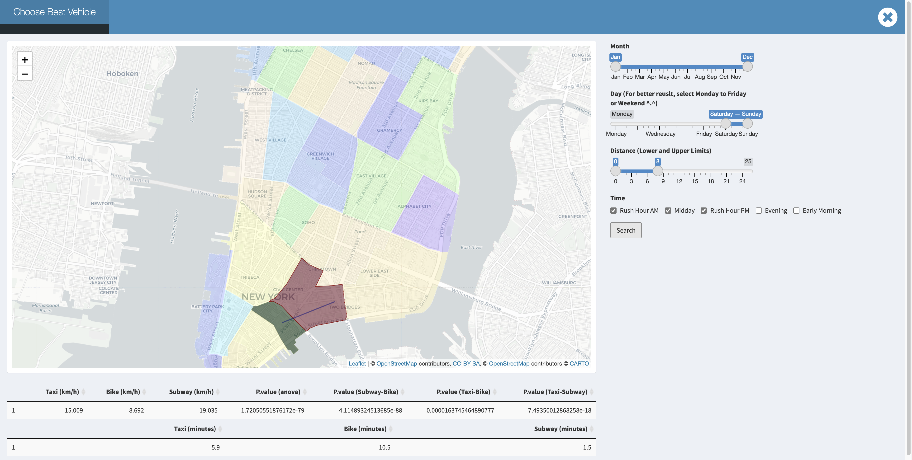

<h1><b><center>Fastest Way to Get Around in Manhattan</center></b></h1>

\

<center>Keming Zhang, Junzhe Shao, Fengjia Chen, Yuchen Zheng, Kaitlyn Wang</center>    
<center>\* All the members contributed equally.</center>   
\


## __Motivation & Related Work__
According to the INRIX scorecard, NYC is ranked No.1 for the worst traffic in the United States. In such an urban region with a dense population, people who do not wish to use personal vehicles have other transportation options such as bike, subway, bus, or taxi. Although it might seem obvious that riding a bike would not outcompete other transportations in a long travel distance at first glance, we want to examine whether this is true in Manhattan, given that its traffic is on the top list of worst traffic in the country. Inspired by the paper Hail a cab or ride a bike? A travel time comparison of taxi and bicycle-sharing systems in New York City, we are interested in whether bicycles can compete with other transportations in terms of travel time in Manhattan in 2020 to 2021 specifically. Considering the weather, rush hour, subway traffic in Manhattan, we focused on the time in a day, weekday versus weekend and seasonal variation to investigate the best time-saving way to commute all year round. Our final goal is to make an interactive map and dashboards that shows the estimated travel time using different transportations at different time periods of the year by just one click! It is expected to be a marketing tool to help those in need of public transportation in NYC to decide the most time-saving and cost-effective way to travel.  

## __Questions__  

The initial question that we were trying to answer was whether riding bike is faster than taking other transportions in Manhattan all year round and to identify possible factors that might contribute to traffic time difference. To examine this question, we did not just look at the travel time of each trip with each transportation, instead, we took into consideration the seasonal variation, rush hours, weekday versus weekend and weather. While we look into the dataset and explore the relation between all numbers, we hope to learn more about the characteristics through answering the following questions:  
  
- What might be the fastest transportation to choose within Manhattan?  
- What is the most popular transportation people choose within a day?  
- How would velocities of transports change according to time and taxi zone differences?
- Is it worth commuting daily driving a car compared to using public transit regardless of the money?  
- What is the distribution of public transit speed rates and how do they vary across the whole year? And what is the pattern of change during a day, a week, a season, or even the weather?  
- What is the geometric difference in choice making and distribution in various taxi zones?  
 
While we were manipulating and having deeper exploration, more useful insights, questions and conclusions came up. During this process, we organized and optimized the raw data, and transformed them into more readable explanations after appropriate processing. Meanwhile, we tried to discover and explain more based on existing data, find out the possible factors that might influence the speed, and combine them with the statistics analysis and map searching. 

## __Data Source__ 

* [NYC Taxi Trip Record Data](https://www1.nyc.gov/site/tlc/about/tlc-trip-record-data.page) : We obtained the yellow taxi, green taxi and taxi zone lookup table from this website. The original yellow and green taxi datasets contain files from Jan. 2020 to Jul. 2021 with 33,671,276 and 749,439 observations, respectively.  

* [Dataset on Citi Bike Trip Histories](https://ride.citibikenyc.com/system-data) : Citibike dataset was obtained from the citibike website, with files from Jan. 2020 to Oct. 2021 including information on pick up locations and times, drop off locations and time, etc in Manhattan, Brooklyn, Queens and Bronx specificaly. 

* [New York City MTA](https://transitfeeds.com/p/mta) : The NYC subway schedule was obtained from the NYC MTA website, which includes 1000 trains' information on stops, arrival and departure time etc. 

* [Climate Data Online](https://www.ncdc.noaa.gov/cdo-web/) : Weather data were chosen from Jun. 2020 to May 2021 with information on months, precipitation etc.
  
## __Data Cleaning__

### General Techniques
The original dataset of taxi and bike is huge, contains ~30,000,000 each. So `dplyr` package is not suitable for that large amont of data which may be intensive for memeory and compuation. 
To handle tabular data, `data.table` is an alternative to R's default `data.frame` or `tibble`. Its popularity stems from the speed with which it can process enormous amounts of data and the brevity of its syntax. As a result, you enter less code and move at a far faster pace.

A key idea for our data cleaning is creating what we call `pickup - dropoff pairs`as a standard basic data entry. It consists of a pickup location, a drop off location, pick up time, drop off time and it's distance. The bike data can be easily transformed into pickup - dropoff pairs. The detail of transformation of MTA data will be described in the corresponding cleaning section.

### Bike Data 
Read in the bike data after sample
```{r eval=FALSE, echo = TRUE}
bike_dt = fread("citibike_manhattan_sample.csv")
bike_dt = bike_dt %>% janitor::clean_names() %>% as.data.table()
head(bike_dt)
bike_dt = bike_dt[, distance_hav := distHaversine(matrix(c(start_station_longitude, start_station_latitude), ncol = 2),
                                   matrix(c(end_station_longitude, end_station_latitude), ncol = 2))]
bike_dt = bike_dt[, distance_ew := distHaversine(matrix(c(start_station_longitude, start_station_latitude), ncol = 2),
                                                  matrix(c(end_station_longitude, start_station_latitude), ncol = 2))]
bike_dt = bike_dt[, distance_ns := distHaversine(matrix(c(end_station_longitude, start_station_latitude), ncol = 2),
                                                  matrix(c(end_station_longitude, end_station_latitude), ncol = 2))]
bike_dt = bike_dt[,angle_ns := atan(distance_ew/distance_ns)*2*(as.numeric(I(start_station_longitude < end_station_longitude))-0.5)*2*(as.numeric(I(start_station_latitude > end_station_latitude))-0.5) - manhattan_angle]
bike_dt = bike_dt[,distance := distance_hav*(abs(cos(angle_ns))+abs(sin(angle_ns)))]
colnames(bike_dt)
```
Some key variables discription:  

* `start_time`: bike start time, a POSIXct item,`end_time` similar  
* `start/end_station_lattitude/longitude`: lattitude/longitude of start/end station  
* `start/end_neighborhood`: the neighborhood, same to the taxi zone  
* `start/end_neighborhood_id`:the neighborhood id, same to the taxi zone id  

Next we need to estimate the distance.In the citibike dataset, trip distance was not provided, The main idea here is treat manhattan blocks as square in 28.9 degree north east, and caculate the angel $\theta$ between the start point-end point line and the block direction of manhattan(28.9 degree). Then the real distance$L_t$ can be estimated from the Haversine distance calculated from lattitude/longitude pairs $L_0$ by $L_t =L_0(\sin(\theta)+\cos(\theta))$.  

`distance_hav` is caculated by`distHaversine()`which is a provided function to calculate the distance from lattitude/longitude pairs from `geosphere`package. then we calculate the `distance_ew` and `distance_ns` to obtain a direction of start point-end point line. `angle_ns` is the $\theta$ between the start point-end point line and the block direction of manhattan(28.9 degree). And we finally obtain the `distance` object. 

Then we do some further data cleaning to format the bike data into our standard data format.
```{r eval=FALSE, echo = TRUE}
bike_dt_select = data.table(DOLocationID = bike_dt$start_neighborhood_id,
                            PULocationID = bike_dt$end_neighborhood_id,
                            tpep_pickup_datetime = bike_dt$start_time,
                            tpep_dropoff_datetime = bike_dt$end_time,
                            trip_distance = bike_dt$distance,
                            PUZone = bike_dt$start_neighborhood,
                            DOZone = bike_dt$end_neighborhood)
bike_dt_select$type = "bike"
```

### Taxi data

```{r eval=FALSE, echo = TRUE}
# read, clean, and sample -----------
res_dt_y = data.table(matrix( ncol = 0, nrow = 0))
#colnames(res_dt_y) = colnames(test_dt_zone)
for (x in list.files("raw_data/data/yellow_taxi")){
  temp_dt = fread(paste("raw_data/data/yellow_taxi/",x,sep =""))
  temp_dt = merge.data.table(temp_dt, PUloation_list, by.y = "LocationID", by.x = "PULocationID")
  temp_dt = merge.data.table(temp_dt, DOloation_list, by.y = "LocationID", by.x = "DOLocationID")
  temp_dt = as.data.table(sample_n(as_tibble(temp_dt),round(nrow(temp_dt)/10)))# random sample 10%
  cat(colnames(temp_dt))
  res_dt_y = rbind(res_dt_y,temp_dt, fill = T)
  print(x)
  print(nrow(temp_dt))
  print(nrow(res_dt_y))
}
# read, clean, and sample
res_dt_g = data.table(matrix(ncol = 0, nrow = 0))
#colnames(res_dt) = colnames(test_dt_zone)
for (x in list.files("raw_data/data/green_taxi")){
  temp_dt = fread(paste("raw_data/data/green_taxi/",x,sep =""))
  temp_dt = merge.data.table(temp_dt, PUloation_list, by.y = "LocationID", by.x = "PULocationID")
  temp_dt = merge.data.table(temp_dt, DOloation_list, by.y = "LocationID", by.x = "DOLocationID")
  temp_dt = as.data.table(sample_n(as_tibble(temp_dt),round(nrow(temp_dt)/10)))# random sample 10%
  #cat(colnames(temp_dt))
  res_dt_g = rbind(res_dt_g,temp_dt, fill = T)
  print(x)
  print(nrow(temp_dt))
  print(nrow(res_dt_g))
}
```
We iteratively read in all target data. Merge the taxi data with the taxi zone data list. and randomly select 10% of samples
Some key variables discription:  

* `PU/DOLocationID`: ID of pickup/drop off location  
* `tpep_pickup/dropoff_datetime`: date and time of pickup/drop off,a POSIXct item  
* `trip_distance` : travel distance in mile  

We can see we have create the basic `pickup - dropoff pairs`

### MTA 

basic analysis tools:
For the subway datasets, we were unable to obtain the real time MTA subway schedule, so the dataset was found on the New York City MTA with no data description. Besides, the subway dataset only categorizes the data to weekday, saturday and sunday, making it inconsistent with other datasets and difficult in making plots for comparison with other transportations. To solve this issue, 
we apply a random simulation with replacement to create the pickup-dropoff pair.

```{r eval=FALSE, echo = TRUE}
mta_dt  = fread('subway_schedule_clean.csv')
test_mta_dt = mta_dt[,.SD[sample(.N,5*.N, replace = T)],by = c("train_id","day","line")]
test_mta_dt = test_mta_dt[, tpep_pickup_datetime := as.POSIXct(departure_time,
                                                               format = "%H:%M:%S",
                                                               tz = "America/New_York")]
test_mta_dt_do = mta_dt[,.SD[sample(.N,5*.N, replace = T)],by = c("train_id","day","line")][, tpep_dropoff_datetime := as.POSIXct(arrival_time,format = "%H:%M:%S",tz = "America/New_York")]             
test_mta_dt= bind_cols(test_mta_dt,test_mta_dt_do) %>% tibble::repair_names()
test_mta_dt = test_mta_dt[, trip_distance := distHaversine(matrix(c(stop_lon...9, stop_lat...8), ncol = 2),
                                                  matrix(c(stop_lon...21, stop_lat...20), ncol = 2))]
test_mta_dt = test_mta_dt[,time:= abs(as.numeric(tpep_dropoff_datetime - tpep_pickup_datetime))]
test_mta_dt = test_mta_dt[,velocity := trip_distance/time]
test_mta_dt = test_mta_dt[time > 60]
test_mta_dt = test_mta_dt[velocity > 0] [velocity < 40]
setnames(test_mta_dt, "neighborhood_id...11", "PULocationID")
setnames(test_mta_dt, "neighborhood_id...23", "DOLocationID")
setnames(test_mta_dt,  "neighborhood...10" , "PUZone")
setnames(test_mta_dt,  "neighborhood...22" , "DOZone")
test_mta_dt = test_mta_dt[day...2 == "Sunday", week:=0]
test_mta_dt = test_mta_dt[day...2 == "Saturday", week:=6]
test_mta_dt[day...2 == "Weekday",]$week = sample(1:5,nrow(test_mta_dt[day...2 == "Weekday",]),replace = T)
test_mta_dt$month = sample(1:12,nrow(test_mta_dt),replace = T)
test_mta_dt = test_mta_dt[,type := "MTA"]
test_mta_final = test_mta_dt[,colnames(test_dt), with = F]
```

The key idea here is we consider all the transit without transfers between lines which the schedule can not simulate. We create 5 times random pairs grouped by `train_id`,`day`,`line` to make sure they are exactly the same train, same line, and same day. 5 fold is enough here because the variance of velocity for the same route is actually small compared to bike and taxi from our prior knowledge. 

### Intergration

To avoid extreme values affecting the results, we filter observations whose velocity and duration were greater than 99 percentile. Since final combined dataset is too big for us to efficiently make plots for visualizations, we again drew a sample of the data to make our plots which generates the following three sample datasets: `taxi_sample.csv`, `bike_sample.csv` and `subway_sample.csv`. New variables were added for visualization purposes which are listed below:

- `Season`: winter(Dec-Feb), spring(Mar-May), summer(Jun-Aug), fall(Sep-Nov)
- `Duration`: the difference between pick up time and drop off time for citibike and subway: the time difference of a trip between a location pair for subway
- `Time of day`: rush_hour_am(7am - 10am), midday(10am - 4pm), rush_hour_pm(4pm - 7pm), evening(7pm - 12am), early_morning(12am - 7am)
- `Velocity`: trip distance divided by duration
- `Day Type`: weekday, weekend 


## __Visualization__

### Taxi, Bike, Subway Visualization

We made two barplots for the top 10 most frequent origin-destination pairs for taxi and bike so that we can see which areas in Manhattan people prefer getting around by taxi and which areas in Manhattan people prefer getting around by bike. We learned that the top 15 most frequent origin-destination pairs for taxi are located in the upper east side and in the upper west side and the top 15 most frequent origin-destination pairs for bike are located in East Village, East Chelsea and Central Park.    

In addition, we made two heatmaps to compare the travel time between taxi and bike. The heat maps show the travel time for bike is overall greater than the travel time for taxi for all day and all seasons and the travel times are the greatest during rush hour from 4pm to 7pm for both taxi and bike. Across four seasons, the travel time is the greatest in winter for taxi and the travel time is the greatest in spring for bike. We also made two heatmaps to compare the velocity between taxi and bike. The velocity for bike is overall smaller than the velocity for taxi all day and all seasons. Taxi travels the slowest during rush hour from 4pm to 7pm all seasons except fall and taxi travels the slowest in winter. Similar to taxi, bike travel the slowest during rush hour from 4pm to 7pm in all seasons except fall.   

Moreover, a duration boxplot was made to compare the travel time on weekdays and weekends for each type of transportation, bike, taxi and subway. The boxplot shows the travel time is greater on weekends for bike. The travel time seems to be similar for the subway on both weekdays and weekends. The travel time for taxi is longer on weekdays. A velocity boxplot was also made to compare the travel velocity on weekdays and weekends for each type of transportation. The velocity boxplot shows the velocities for the subway on both weekdays and weekends are the greatest and they are similar across the week. Taxi travels faster on the weekend and bike travels faster on weekdays.  

### Weather Influence
Transportation Trend vs Month
The trends for people choose to travel outside are generally similar no matter using bikes or cabs. But it exists a more significant drop for choosing taxi during the June and less people ride bikes during Dec and Feb. After analyzing the possible casuals, June is the month for students within NYU start their Summer Vacations. So the traffic pressure has a visualized decrease with more people still live in NYU. And for people, especially students, who still live in NYU, they do not have the need to commute in a hurry. Also, with the temperature getting colder and colder, people will prefer more stay at home comparing to traveling and less possibility for them to riding bikes outside. The temperature of the weather could be a confounder to transport choice and month model, but not for special month June.

#### Wind Speed vs Velocity
It’s interesting to find out the truth that following by the increasing of wind speed, velocity of bikes is increasing as well. While at the same time, wind speed does nearly no influence to taxi drivers. 

#### Rain Precipitation vs Velocity
Velocity could be regarded as one parameter to judge the flow of a transportation. Obviously from the plots showing the connection between the velocity and the mode of transport, the velocity of taxi are faster to bike on average. And the light to moderate rain (<30 mm), precipitation seems have no impact to the velocity, especially while taking a look at bike data. That might because though raining will make road more slippery, it also has washing effect to environment and other effects. The combination of all effects make velocity nearly stay the same. Moreover, the more amount of rain is, the slower the traffic it would be, the less people would choose to travel and it is more likely to choose taxi while weather condition getting even worse compared to riding. That might because a heavy rain might possibly affect drivers and riders visibility, thus decreases the vehicle speed and affects travel choice.

#### Temperature vs Transportation trends vs Velocity 

The distribution and trends of travel choice among taxi and bikes are distinct different. People tend to choose taxi travel plan while in relatively low temperature and will change to bike preference when there is significant increase in temperature. People have more possibility to stay home when meet with extreme high temperature. It could be concluded that people are more willing to travel outside under the moderate temperature, the higher, lower or even extreme temperature the weather is, the less potential likelihood that people will go outside and use the transport. It also comes an interesting phenomenon that taxi tends to run faster and bike runs slower with the temperature increase. The faster of the taxi could because of the decrease of the traffic pressure and the better road condition. At the same time, snow effect makes riders drive quicker for getting avoid of staying outside and keep warm.

## __Exploratory Analysis__

### Analysis

Analysis methods here is simple and straightforward. We find that the velocity fits gaussian distribution well. a simple `t.test()` or `aov()` test will be good. Since we are considering a more detailed location based model. multinomial mixed logistic model which is generally the best model for transportation decision question is not necessary here. We have the following function to make the selection process tidy and we will adopt `data.table` all the time to make the deployment effcient. Here is a sample function for analysis on our website. We can analysis result from any scale simply by cancel some key variables

```{r eval=FALSE, echo = TRUE}
test_function = function(month_in, week_in, data = test_dt,PU,DO, distance_range_low = 0, distance_range_up = 6){
  x = data[month %in% month_in][week %in% week_in][type == 'taxi'][trip_distance >= 1000*distance_range_low][trip_distance <= 1000*distance_range_up][PUZone == PU][DOZone == DO][,.(velocity)]
  x %>% hist()
  y = data[month %in% month_in][week %in% week_in][type == 'bike'][trip_distance >= 1000*distance_range_low][trip_distance <= 1000*distance_range_up][PUZone == PU][DOZone == DO][,.(velocity)]
  hist(as.numeric(as.data.frame(y)))
  z = data[month %in% month_in][week %in% week_in][type == 'bike'][trip_distance >= 1000*distance_range_low][trip_distance <= 1000*distance_range_up][PUZone == PU][DOZone == DO][,.(velocity)]
  hist(as.numeric(as.data.frame(z)))
}
test_function(month_in = c(1,6,7),week_in = c(1,2,3), PU = "Washington Heights South", DO = "Morningside Heights",
              distance_range_low = 0, distance_range_up = 20, data = rbind(test_dt,test_mta_final))
```

Afterwards we can extract the mean estimate and a p.value based on either t.test or ANOVA.

### Regression 
We wound like to address a regression analysis to given out a more precise description of how climate factors affect the velocity besides initial data exploration.

For bike data:
```{r include = FALSE}
library(tidyverse)
weather_df = read_csv('weather_transport_df.csv')
```
```{r}
lm_velocity <-
  weather_df %>%
  filter(type == "bike") %>%
  mutate(month = as.factor(month)) %>% as.data.frame()

lm(velocity ~ trip_distance + awnd + prcp + snwd + tmax + tmin, data = lm_velocity) %>% summary()
```
We can discover that the regression coefficient for `prcp`,`tmin`,`trip_distance` is significant under 0.1 significance level. 

The estimates are: 

* `prcp`: 9.348e-04
* `tmin`: -2.337e-03
* `trip_distance`: 1.844e-04
  
This is consistent with our initial data visualizaiton findings.
  
For taxi data:
```{r}
lm_velocity <-
  weather_df %>%
  filter(type == "taxi") %>%
  mutate(month = as.factor(month)) %>% as.data.frame()
lm(velocity ~ trip_distance + awnd + prcp + snwd + tmax + tmin, data = lm_velocity) %>% summary()
```
We can see that only `trip_distance` is significant, which is consistent with our prior knowledge and the data exploration before. 


## __Interaction Map__
he data visualization above is an overall analysis, in order to analyze the velocity between from one taxi zone to the others through different vehicles and show their geographical locations clearly, we created ___two interactive map applications___ using `R Shiny`.   
  
#### [**Velocity Heatmap**](http://34.138.2.255:3838/heatmap/)    
Velocity heatmap is aimed to provide a tool to better analyze the velocity differences among different taxi zones during different times of the day in different months. To create this velocity heatmap, we first integrated the leaflet package to incorporate a worldwide map, drew polygons on Manhattan and divided the areas based on the taxi zone map. Adding click actions on the map is also necessary for there are 69 taxi zones, making it hard to select taxi zones through traditional methods, like select boxes.  
  
Users are able to navigate through this velocity heatmap by selecting desired zone, vehicle type, month, day and time to compare the speed. By clicking the relative taxi zone as our departure, it helps to explore and calculate the mean speed rate to different taxi zones, and create interactive plots that respond to each mouse event, combined with R’s graphics functions.  
  
<center>

{width=700px}

<center/>
  
#### [**Choose Best Vehicle**](http://34.138.2.255:3838/bestvehicle/)  
Besides comparing the speed from a fixed taxi zone to others, we also create an interactive map application to compare the speed from one taxi zone to another through taxi, bike and subway to see which one is the best during different times of the day in different months.  
  
While using this app, the users would be able to choose whatever the departure taxi zone and destination taxi zone are within Manhattan using graphic straightforward clicking. With the synchronous web search for either pick up or drop off location.

<center>

{width=700px}

<center/>

## __Problems We Met__

Some challenges arose during development using `R Shiny` and the `leaflet` package. We needed to divide the Manhattan region to different taxi zones on the map and identified each click response with the corresponding area range. During which we came up and identified several problems and solved those difficulties as described below:

- ___Reducing dataset and identifying the information of taxi zones specifically within Manhattan.___   
There was a large dataset we downloaded from the website which included all data within the NYC location. We targeted to reduce the size of the data and concentrated only on the Manhattan area. Among all the information, we first identified all taxi zone names in NYC and filtered them only within Manhattan that we focused on and recorded them with the new numbers from 1 to 69.   

- ___Draw map and draw zone polygons according to taxi zone division.___     
Unlike worldwide maps that could be directly imported using `leaflet()`, the taxi zone division on Manhattan should be further processed. We downloaded a [Manhattan data](https://www1.nyc.gov/site/tlc/about/tlc-trip-record-data.page) from the web and got their location data after data cleaning. `addPolygons()` function required us to define the columns of latitude and longitude, which could be derived from our data, linking adjacent points using lines and creating shapes of interest.  

- ___What if the pick up location and drop off location are in the same taxi zone?___    
Regarding our original code, the same location could not be clicked twice which means if we double click the same taxi zone and set it as both our origin and destination, the function would return `point_bool` parameter from `TRUE` to `FALSE` and led to visualization error. To solve this problem, we used the `if` function to specify this special situation.  

- ___Merging problems while cooperating with branches.___  
We had several branches while we were dealing with our codes, and all codes would be pushed to our personal branch first before finally merging into the main branch. As we had two people mainly dealing with the `Shiny` application that needed cooperation work, it required a lot of merging process and there were several times when code overlapped or merging problems on local paths arose. Solving this problem required constant updates between members.

## __Findings and Conclusions__
### The Velocity Distribution of Taxi Zones
#### Bike
The velocity of bike among different taxi zones is various according to the distance of every taxi zones to _Washington Heights South_. However, possibly contrary to the usual hypothesis, _the average velocity of bike increases with distance increasing_! We think there are two possible reasons lead to this phenomenon. One explanation is that those who have to ride for long distance borrow electric bikes at the beginning, which are apparently faster than the usual bikes. Another explanation is that those who choose to ride to far places have better physical strength. Therefore, they can ride faster than usual riders.

<center></center>

\  
\ 
  
#### Taxi
What is worth emphasizing here is that the more taxi zones that you cross, the faster velocity that we might obtain no matter where our pick up location is and what our transport is. We guess it might be because of the longer travel distance we have, the drivers or riders would more likely to choose the high way, the road with low traffic and avoid traffic lights.s we know the midtown of Manhattan is known for its bustling and busy traffic, the mean velocity in midtown is significantly slower compared to neighborhoods in Uppertown and Downtown.   

*Downtown traffic for rush day:* 


  
*The more taxi zones that you cross, the faster velocity that we might obtain no matter where our pick up location is:*  




Moreover, the velocity in Uppertown and Randalls Island would be even quicker. We notice that the traffic on Randalls Island usually performs better, and this might because of the lower population density. We also known from the web that this is a parkland island and there is no residential housing for the general public except for some public facilities. And the specific traffic time would be more dependent on where you are coming from and where you are going to.

*Uppertown and Randalls Island would be even quicker:* 
  


\
\  

#### Subway

The average velocity of subway is quit stable among different taxi zones on the subway line. Possibly more influenced by the waiting time on the station platform, subways are not influenced by the traffic jam.

<center></center>
  
    
    
\
\
\
\

### Fastest Way to Get Around in Manhattan: A Summary
As is shown in data exploration, taxi is faster than bike in terms of mean velocity. And the difference is significant. Where MTA is always reliable, but we should note that MTA has its own schedule, so we need to consider extra time for waiting and walking.

But when you are in downtown manhattan at a week day rush hour , We can discover that bike become competitive for a short trip. For example:


While in weekend or non rush hour, taxi will still be faster than bike in downtown Manhattan for a short trip.

