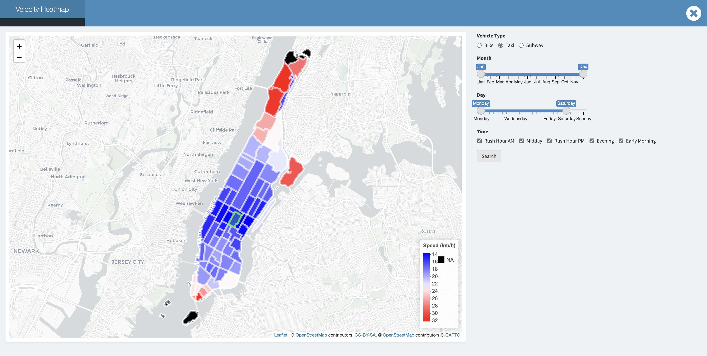
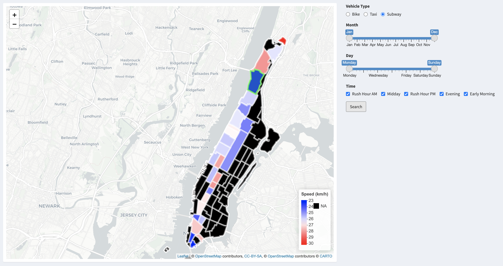
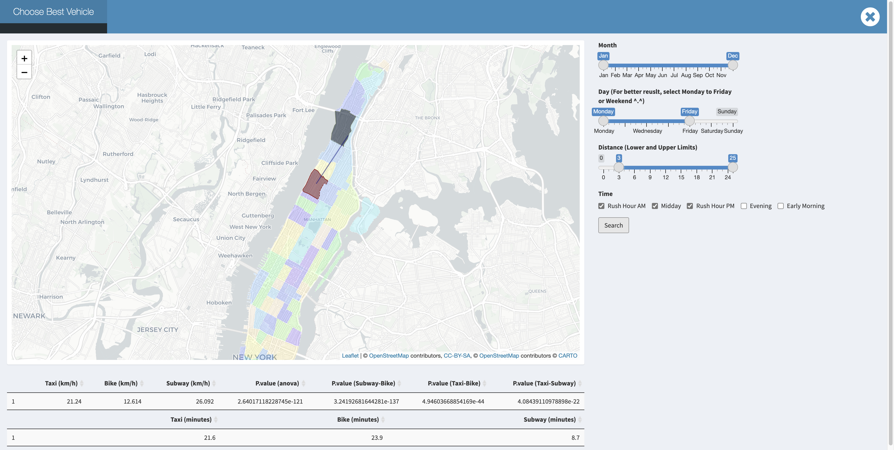
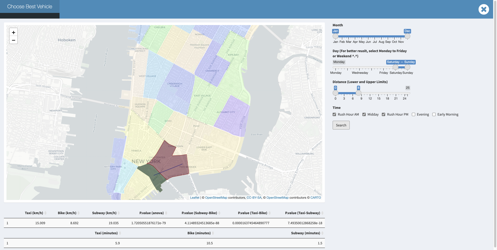

```{r setup, include=FALSE}
knitr::opts_chunk$set(echo = TRUE)
```

## __The Velocity Distribution of Taxi Zones__
### Bike
The velocity of bike among different taxi zones is various according to the distance of every taxi zones to _Washington Heights South_. However, possibly contrary to the usual hypothesis, _the average velocity of bike increases with distance increasing_! We think there are two possible reasons lead to this phenomenon. One explanation is that those who have to ride for long distance borrow electric bikes at the beginning, which are apparently faster than the usual bikes. Another explanation is that those who choose to ride to far places have better physical strength. Therefore, they can ride faster than usual riders.

<center></center>

\  
\ 
  
### Taxi
What is worth emphasizing here is that the more taxi zones that you cross, the faster velocity that we might obtain no matter where our pick up location is and what our transport is. We guess it might be because of the longer travel distance we have, the drivers or riders would more likely to choose the high way, the road with low traffic and avoid traffic lights.s we know the midtown of Manhattan is known for its bustling and busy traffic, the mean velocity in midtown is significantly slower compared to neighborhoods in Uppertown and Downtown.   

*Downtown traffic for rush day:* 


  
*The more taxi zones that you cross, the faster velocity that we might obtain no matter where our pick up location is:*  


Moreover, the velocity in Uppertown and Randalls Island would be even quicker. We notice that the traffic on Randalls Island usually performs better, and this might because of the lower population density. We also known from the web that this is a parkland island and there is no residential housing for the general public except for some public facilities. And the specific traffic time would be more dependent on where you are coming from and where you are going to.

*Uppertown and Randalls Island would be even quicker:* 
  


\
\  

### Subway

The average velocity of subway is quit stable among different taxi zones on the subway line. Possibly more influenced by the waiting time on the station platform, subways are not influenced by the traffic jam.

<center></center>
  
    
    
\
\
\
\

## __Fastest Way to Get Around in Manhattan: A Summary__
As is shown in data exploration, taxi is faster than bike in terms of mean velocity. And the difference is significant. Where MTA is always reliable, but we should note that MTA has its own schedule, so we need to consider extra time for waiting and walking.

But when you are in downtown manhattan at a week day rush hour , We can discover that bike become competitive for a short trip. For example:


While in weekend or non rush hour, taxi will still be faster than bike in downtown Manhattan for a short trip.



\
\

